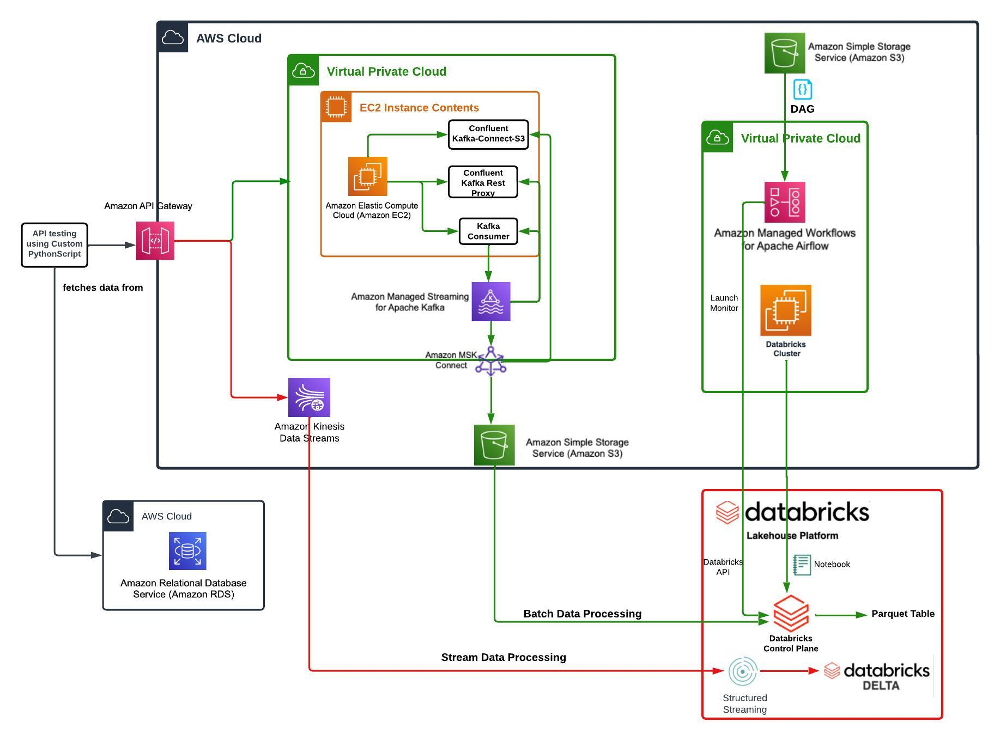

# Pinterest Data Pipeline Project

---

## Project Description:
This project implements a data pipeline to process real-time and batch data streams using AWS Kinesis, AWS MSK (Managed Streaming for Kafka), and Databricks. It aims to replicate Pinterest's experimental data pipeline, integrating both real-time stream processing and batch-oriented workflows. The pipeline is designed to ingest, process, and store data from various sources such as Pinterest, Geolocation, and User data. Apache Kafka and AWS Kinesis are used for event streaming, while Apache Spark handles data transformations and writing to Delta tables in Databricks.

---

## Architecture Diagram:



---

## Table of Contents:
- [Project Description](#project-description)
- [Batch Processing](#batch-processing)
- [Kinesis Streaming](#kinesis-streaming)
- [Technologies Used](#technologies-used)
- [Usage](#usage)
- [File Structure](#file-structure)
- [What I Learned](#what-i-learned)
- [Improvements (If I Had More Time)](#improvements-if-i-had-more-time)
- [License](#license)

---

## Batch Processing

The batch processing component of the pipeline starts by setting up an EC2 instance to run Kafka, and MSK (Managed Streaming for Kafka) streams data into an S3 bucket. API Gateway sends data to the MSK cluster, where Kafka topics capture data for batch processing. Databricks mounts the S3 data and processes it using Apache Spark, applying cleaning and transformation steps to Pinterest, geolocation, and user data before storing it in Delta tables for analysis. AWS MWAA (Managed Workflows for Apache Airflow) orchestrates the batch workflows, automating the entire process.

---

## Kinesis Streaming

In the real-time streaming component, AWS Kinesis Data Streams handle live data from various sources. API Gateway integrates with Kinesis to stream the data, which is consumed by Databricks. Spark in Databricks processes the streaming data, performing necessary transformations such as cleaning and formatting before saving it into Delta tables. This ensures continuous data flow, allowing real-time analysis of the data as it moves through the pipeline.

---

## Technologies Used:

- **Apache Kafka**: Event streaming platform for real-time data capture and processing.
- **AWS MSK**: Managed Kafka service that simplifies streaming event ingestion.
- **AWS API Gateway**: Used to expose APIs for managing the data flow.
- **AWS Kinesis**: Real-time streaming service for processing continuous data streams.
- **Databricks**: Unified analytics platform for batch and stream processing with Apache Spark.
- **PySpark**: Python API for Spark, used for real-time and batch data processing.
- **MWAA**: Managed workflows with Airflow to automate and schedule batch processes.
- **Delta Lake**: Storage layer that provides reliability and performance for big data processing.

---

## Usage:

1. **Data Ingestion**:
   - Kinesis and Kafka streams feed data into Databricks using Spark.
   
2. **Data Cleaning**:
   - Both real-time and batch data streams undergo transformation and cleaning in Databricks before being written to Delta tables.

3. **Data Storage**:
   - Cleaned data is stored in Delta tables:
     - `12b83b649269_pin_table`
     - `12b83b649269_geo_table`
     - `12b83b649269_user_table`

4. **Execution**:
   - Batch processing is orchestrated using Apache Airflow (MWAA), while Databricks Structured Streaming handles real-time data streams.

---

## File Structure:

```plaintext
pinterest-data-pipeline652/
├── .gitignore
├── 0ec6d756577b_dag.py                      # Airflow DAG for batch processing
├── Kinesis Streaming 2024-09-23.ipynb        # Jupyter Notebook for Kinesis streaming
├── Mount S3 to Databricks 2024-08-27.ipynb   # Jupyter Notebook for mounting S3 and running queries
├── Pinterest_Data_Pipeline_Architecture.png  # Cloud architecture diagram
├── README.md                                # Documentation
├── user_posting_emulation.py                # Script for simulating post data
├── user_posting_emulation_streaming.py      # Script for simulating streaming data

## What I Learned:

- **Real-time stream processing**: Gained proficiency in handling real-time data streams using AWS Kinesis and Apache Kafka.
- **Batch processing**: Developed skills in batch processing workflows using AWS MSK (Managed Streaming for Kafka) and orchestrating them with Apache Airflow (MWAA).
- **Data transformation**: Learned how to perform large-scale data transformations using **PySpark** in Databricks.
- **AWS Integration**: Gained hands-on experience integrating various AWS services (Kinesis, MSK, S3, Databricks) into a unified data pipeline.
- **Big Data management**: Developed an understanding of how to process, clean, and store large datasets in **Delta Lake** tables for both real-time and batch processing use cases.

---

## Improvements (If I Had More Time):

- **Performance Tuning**: Optimize batch and streaming jobs for higher efficiency.
- **Security Enhancements**: Implement better security practices, such as encrypting data in transit and at rest, and using IAM roles for restricted access.
- **Monitoring & Alerts**: Add more comprehensive monitoring and alerting mechanisms using CloudWatch and Datadog.
- **Cost Optimization**: Introduce cost-saving mechanisms, such as auto-scaling and serverless options like AWS Lambda where appropriate.
- **Enhanced Data Quality Checks**: Implement more rigorous data validation and anomaly detection mechanisms within the data pipeline to ensure higher data accuracy.

---

## License:
This project is licensed under the MIT License. Feel free to use, modify, and distribute the code as per the terms of the license.


